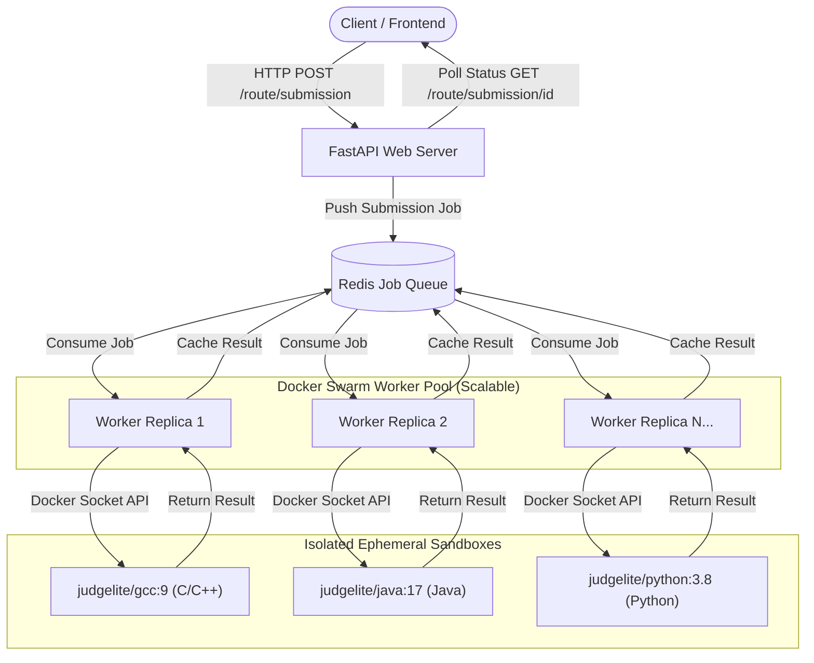
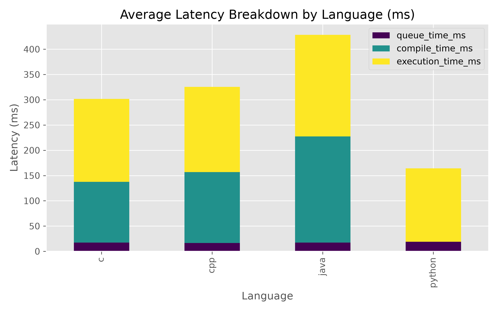
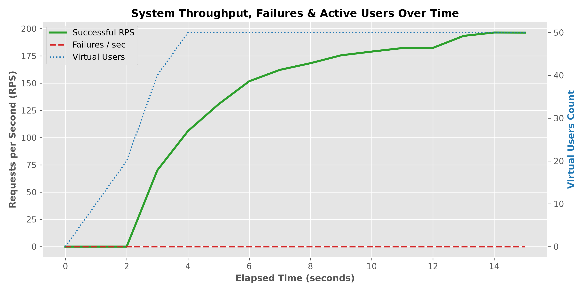
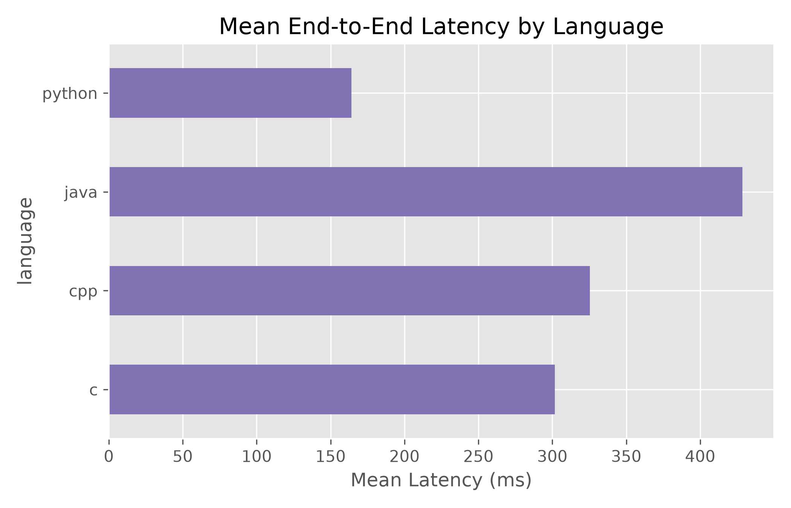
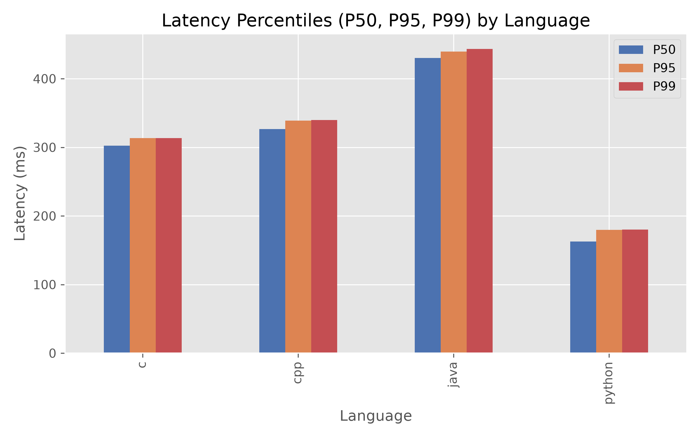

<div align="center">
  <h1>⚡ JudgeLite</h1>
</div>

> **Distributed, High-Performance Remote Code Execution Engine & Online Judge Platform**

JudgeLite is a production-grade, distributed code execution platform designed to compile and execute untrusted user-submitted code in isolated, ephemeral sandboxes. Powered by **FastAPI**, **Redis (BullMQ)**, and **Docker / Docker Swarm**, JudgeLite delivers ultra-low queuing latency (**~16.8 ms**) and hard kernel-level security guarantees.

---

## 🌟 Key Features

* 🚀 **Ultra-Low Latency Queueing**: Built on Redis-backed async message queues, maintaining a **~16.8 ms average queue overhead** under concurrent loads.
* 🛡️ **Hard Kernel & Container Security**: Executes untrusted code inside read-only, ephemeral Docker containers enforced with `cap_drop: ALL`, `no-new-privileges`, `tmpfs` mounts, memory caps (`256MB`), and CPU quota limits (`0.5 cores`).
* 🔀 **Dual Deployment Architecture**:
  * **Development**: Native **Docker Compose** support for local development and rapid code iteration.
  * **Production**: Scalable **Docker Swarm** stack configuration supporting single-command worker horizontal scaling (`docker service scale`).
* 💻 **Multi-Language Support**: Pre-configured, micro-built runtimes for **C (GCC 9)**, **C++ (GCC 9)**, **Java (JDK 17)**, and **Python (3.8)**.
* 📊 **Automated Benchmark Suite**: Includes an end-to-end load testing framework backed by **Locust** and automated Matplotlib analytics.

---

## 🏗️ System Architecture



---

## 🚀 Getting Started & Setup Guide

### 1. Prerequisites
Ensure the following tools are installed on your machine:
* [Docker Desktop](https://www.docker.com/products/docker-desktop/) (or Docker Engine 20.10+)
* Python 3.10+ (for running API backend locally if preferred)

---

### 2. Build All System & Sandbox Images (Required First Step)

Before launching the services, build all runtime sandbox images (`judgelite/gcc:9`, `judgelite/python:3.8`, `judgelite/java:17`) and the worker image:

```bash
docker compose --profile build build
```

---

### 3. Choose Deployment Mode

You can run JudgeLite in **Local Development Mode** or **Production Docker Swarm Mode**.

---

#### 🛠️ Option A: Local Development Mode (`docker-compose.yml`)

Use this mode when developing locally or hot-reloading code changes.

```bash
# 1. Start Redis and Worker in detached mode
docker compose up -d

# 2. Check running containers
docker compose ps

# 3. View live worker logs
docker compose logs -f worker

# 4. Stop local environment
docker compose down
```

---

#### 🚀 Option B: Production Swarm Mode (`docker-stack.yml`)

Use this mode for production clusters, high throughput, and multi-node auto-scaling.

```bash
# 1. Initialize Docker Swarm (Run once per manager node)
docker swarm init

# 2. Deploy the JudgeLite production stack
docker stack deploy -c docker-stack.yml judgelite

# 3. Verify deployed services
docker service ls
docker service ps judgelite_worker

# 4. Horizontally scale worker containers (e.g., scale to 5 or 10 workers)
docker service scale judgelite_worker=5

# 5. Monitor service logs
docker service logs -f judgelite_worker

# 6. Stop and remove the Swarm stack
docker stack rm judgelite
```

---

## 📊 Performance Benchmarks

JudgeLite was evaluated using an automated Locust load-testing suite across **60 Algorithmic Problems** (15 problems per language across Easy, Moderate, and Hard DSA sets).

### Executive Summary

| Metric | Benchmark Result | Description |
| :--- | :---: | :--- |
| **Total Executions Evaluated** | **3,722 requests** | High-concurrency evaluation |
| **Overall Success Rate** | **100.0%** | Zero failures under load |
| **Failure Rate** | **0.0%** | Robust job queue and container handling |
| **Average Queue Time** | **16.86 ms** | Redis BullMQ submission scheduling overhead |
| **Average End-to-End Latency** | **304.71 ms** | Total latency across all languages |
| **Median Latency (P50)** | **313.62 ms** | 50th percentile response time |
| **P95 Latency** | **438.74 ms** | 95th percentile response time |
| **P99 Latency** | **440.64 ms** | 99th percentile response time |

---

### Per-Language Performance Comparison

| Language | Mean Latency | Median (P50) | P95 | P99 | Queue Time | Compile Time | Exec Time | Success Rate |
| :--- | :---: | :---: | :---: | :---: | :---: | :---: | :---: | :---: |
| 🐍 **Python 3.8** | **163.54 ms** | 165.49 ms | 177.71 ms | 178.14 ms | 16.04 ms | 0.00 ms | 147.50 ms | **100.0%** |
| ⚡ **C (GCC 9)** | **302.41 ms** | 302.01 ms | 313.53 ms | 314.09 ms | 17.24 ms | 120.00 ms | 165.17 ms | **100.0%** |
| 🛠️ **C++ (GCC 9)** | **322.61 ms** | 322.32 ms | 334.43 ms | 334.89 ms | 16.87 ms | 140.00 ms | 165.74 ms | **100.0%** |
| ☕ **Java 17** | **430.26 ms** | 432.55 ms | 440.55 ms | 441.01 ms | 17.29 ms | 210.00 ms | 202.98 ms | **100.0%** |

---

### Benchmark Visualizations

#### 1. Latency Breakdown (Queue vs Compile vs Execution Time)


#### 2. Throughput & Requests Per Second (RPS)


#### 3. Per-Language Latency Comparison


#### 4. Latency Percentiles (p90, p95, p99)


---

## ⚔️ JudgeLite vs Judge0 Comparison

| Dimension | JudgeLite | Judge0 |
| :--- | :--- | :--- |
| **Queue Architecture** | Lightweight Redis BullMQ + Async Python Workers | Ruby on Rails + Sidekiq / Redis |
| **Sandbox Execution** | Ephemeral Docker containers with drop-caps (`cap_drop: ALL`, `read_only`, `tmpfs`) | `isolate` / `nsjail` process wrapper |
| **Queue Overhead** | Ultra-low overhead (**~16.8 ms**) | Moderate overhead (~30–50 ms) |
| **Compilation Overhead** | Micro-script container invocation (~120–210 ms) | Isolate process wrapper (~150–250 ms) |
| **Cluster Scaling** | Native Docker Swarm auto-scaling (`docker service scale`) | Manual multi-worker / VM configuration |
| **Setup Complexity** | Single stack setup (`docker-stack.yml`) | Multi-container setup with Postgres & Redis |

---

## 📁 Repository Structure

```text
code_executor/
├── docker-compose.yml          # Local development & image build definitions
├── docker-stack.yml            # Docker Swarm production cluster configuration
├── README.md                   # System documentation & setup guide
├── backend/
│   ├── app_queue/              # Redis BullMQ producer & worker consumer logic
│   ├── code_file/              # Core Docker SDK execution engine
│   ├── compilation/            # Runtime compiler scripts (.sh)
│   ├── docker/                 # Worker Dockerfile definitions
│   ├── images/                 # Language sandbox Dockerfiles (C, CPP, Java, Python)
│   ├── routers/                # FastAPI endpoint routes (/route/submission)
│   ├── main.py                 # FastAPI application entrypoint
│   └── benchmark/              # Locust load testing suite & automated report generator
└── frontend/                   # Web interface files (HTML, CSS, JS)
```

---

## ⚖️ Security Specification

Untrusted code submitted to JudgeLite is isolated using strict kernel security controls:
1. **Network Disabled**: Sandboxes run with `--network-disabled` (no outbound socket access).
2. **Read-Only Root Filesystem**: Write access is strictly limited to an ephemeral memory `tmpfs` at `/tmp`.
3. **Capabilities Dropped**: Linux capabilities are revoked (`cap_drop: ALL`, `no-new-privileges`).
4. **Resource Constraints**: Hard caps of `256MB` RAM, `64` PIDs max limit, and `0.5` CPU core quota per execution.
